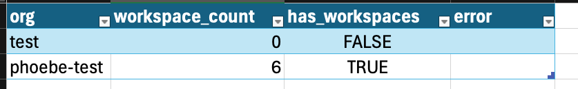
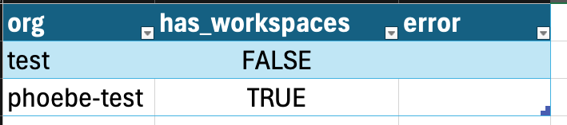

# TFE Workspace Count Checker

This script iterates through all organizations in a Terraform Enterprise (TFE) instance
to check for the existence of workspaces.

## Features

- Queries all or specified organizations to check for workspaces
- Supports two operational modes: count all workspaces or just check if any exist
- Generates CSV report
- Uses multithreading to process multiple organizations concurrently for improved performance
- Reports total script runtime at completion

## Usage Flow

1. **Count Mode:**  
   Run the script with `--mode count` (default) to get exact workspace counts for each organization.

2. **Empty-Only Mode:**  
   Run the script with `--mode empty-only` for faster processing when you only need to identify which organizations have no workspaces. Report will be only include TRUE/FALSE.

## Usage

```sh
python check-workspace-count.py --config CONFIG_FILE [--orgs ORGS] [--mode MODE] [--log-level LEVEL] [--max-workers N]
```

### Arguments

- `--config`: Path to YAML config file (required). Config file can contain organization names under the `organizations` key.
- `--mode`: Operation mode.
    - `'count'`: Get exact workspace counts for all organizations (default).
    - `'empty-only'`: Only check if organizations have any workspaces (faster).
- `--orgs`: Path to a file with org names (one per line) or comma-separated list of org names.
- `--log-level`: Set the logging level (`DEBUG`, `INFO`, `WARNING`, `ERROR`, `CRITICAL`).
- `--max-workers`: Number of concurrent threads to use for processing organizations (default: 5).

### Environment

- Requires an admin API token for authentication.
- Set the token using the `TFE_ADMIN_TOKEN` environment variable, or you will be prompted securely.

### Notes

- The script will detect organizations that don't exist and report them as errors
- Everything will be logged to both the console and `execution.log`
- A CSV report will be written to `workspace_report_%Y%m%d_%H%M%S.csv`
- **Organization selection precedence:**
    1. If the optional `--orgs` flag is provided:
        - If the value is a path to a file, each line in the file is treated as an organization name.
        - Otherwise, the value is parsed as a comma-separated list of organization names (e.g., `org1,org2,org3`).
    2. If `--orgs` is not provided, but the config file (provided via `--config`) contains an `organizations` key, those organizations are used.
    3. If neither of the above are provided, the script will fetch and process all organizations available in the TFE instance.

## Example config file (YAML)

```yaml
tfe_url: https://tfe.example.com

# Optional list of organizations to iterate over.
# If not provided, script will iterate over all organizations.
# organizations:
#  - org-name-1
#  - org-name-2
#  - org-name-3
```

### CSV Report

The script generates a CSV report with the following columns:

In count mode:
- `org`: Organization name
- `workspace_count`: Number of workspaces in the organization
- `has_workspaces`: Whether the organization has any workspaces (TRUE/FALSE)
- `error`: Error message if an error occurred (empty otherwise)

In empty-only mode:
- `org`: Organization name
- `has_workspaces`: Whether the organization has any workspaces (TRUE/FALSE)
- `error`: Error message if an error occurred (empty otherwise)


## Example Output & CSV Reports
<details>

<summary>Example `--mode=count` (default) output</summary>

```
python3 check-workspace-count.py --config config.yml --orgs phoebe-test,test         
Enter your admin token: 
2025-06-12 10:48:30,237 - MainThread - INFO - Found 2 orgs
2025-06-12 10:48:30,239 - MainThread - INFO - Orgs: ['phoebe-test', 'test']
2025-06-12 10:48:30,242 - ThreadPoolExecutor-0_0 - INFO - Checking workspaces for org: phoebe-test
2025-06-12 10:48:30,246 - ThreadPoolExecutor-0_1 - INFO - Checking workspaces for org: test
2025-06-12 10:48:30,498 - ThreadPoolExecutor-0_1 - INFO - Organization test has no workspaces
2025-06-12 10:48:30,499 - MainThread - INFO - [1/2] Finished processing org
2025-06-12 10:48:30,656 - ThreadPoolExecutor-0_0 - INFO - Organization phoebe-test has 6 workspaces
2025-06-12 10:48:30,657 - MainThread - INFO - [2/2] Finished processing org
2025-06-12 10:48:30,659 - MainThread - INFO - CSV report written to workspace_report_20250612_104830.csv
2025-06-12 10:48:30,659 - MainThread - INFO - 
==== WORKSPACE SUMMARY (COUNT MODE) ====
2025-06-12 10:48:30,660 - MainThread - INFO - Total organizations processed: 2
2025-06-12 10:48:30,660 - MainThread - INFO - Organizations with workspaces: 1 (50.0%)
2025-06-12 10:48:30,661 - MainThread - INFO - Organizations with NO workspaces: 1 (50.0%)
2025-06-12 10:48:30,661 - MainThread - INFO - Organizations with errors: 0 (0.0%)
2025-06-12 10:48:30,661 - MainThread - INFO - 
Total script runtime: 0.42 seconds (0.01 minutes)
```



</details>

<details>

<summary>Example `--mode=empty-only` output</summary>

```
python3 check-workspace-count.py --config config.yml --mode empty-only --orgs phoebe-test,test
Enter your admin token: 
2025-06-12 11:05:37,767 - MainThread - INFO - Found 2 orgs
2025-06-12 11:05:37,767 - MainThread - INFO - Orgs: ['phoebe-test', 'test']
2025-06-12 11:05:37,770 - ThreadPoolExecutor-0_0 - INFO - Checking workspaces for org: phoebe-test
2025-06-12 11:05:37,770 - ThreadPoolExecutor-0_1 - INFO - Checking workspaces for org: test
2025-06-12 11:05:38,201 - ThreadPoolExecutor-0_1 - INFO - Organization test has no workspaces
2025-06-12 11:05:38,202 - MainThread - INFO - [1/2] Finished processing org
2025-06-12 11:05:38,247 - ThreadPoolExecutor-0_0 - INFO - Organization phoebe-test has workspaces
2025-06-12 11:05:38,247 - MainThread - INFO - [2/2] Finished processing org
2025-06-12 11:05:38,248 - MainThread - INFO - CSV report written to workspace_report_20250612_110538.csv
2025-06-12 11:05:38,248 - MainThread - INFO - 
==== WORKSPACE SUMMARY (EMPTY-ONLY MODE) ====
2025-06-12 11:05:38,248 - MainThread - INFO - Total organizations processed: 2
2025-06-12 11:05:38,248 - MainThread - INFO - Organizations with workspaces: 1 (50.0%)
2025-06-12 11:05:38,248 - MainThread - INFO - Organizations with NO workspaces: 1 (50.0%)
2025-06-12 11:05:38,248 - MainThread - INFO - Organizations with errors: 0 (0.0%)
2025-06-12 11:05:38,248 - MainThread - INFO - 
Total script runtime: 0.48 seconds (0.01 minutes)
```



</details>

